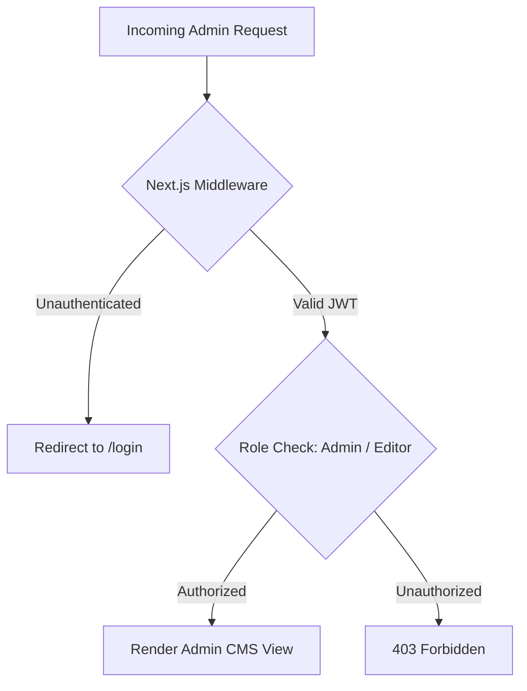

# Admin Application & Authentication Boundary

## Purpose & Scope

`apps/admin` is the dedicated web application for Dar ElMashrq company staff, editors, and managers.

It allows authorized internal users to:
1. Add, edit, reorder, and archive projects.
2. Upload high-resolution project photography.
3. Manage countries, project categories, and services metadata.
4. Update company certifications and profile information.

---

## Strict Isolation Boundary

To maintain production security and performance:

1. **Independent Process**: The admin app runs on a dedicated port (`3001` in local development) or subdomain (`admin.elmashrq.com` in production).
2. **Zero Shared UI Bloat**: Public visitors to `apps/web` never download admin form libraries, CMS tables, or upload widgets.
3. **Search Engine Protection**: `apps/admin` layout strictly injects:
   ```html
   <meta name="robots" content="noindex, nofollow, noarchive" />
   ```
4. **Isolated Authentication**: Session tokens (HTTP-only JWT cookies) belong exclusively to the admin domain and are never shared with public website traffic.

---

## Authentication Strategy (Phase 03)


