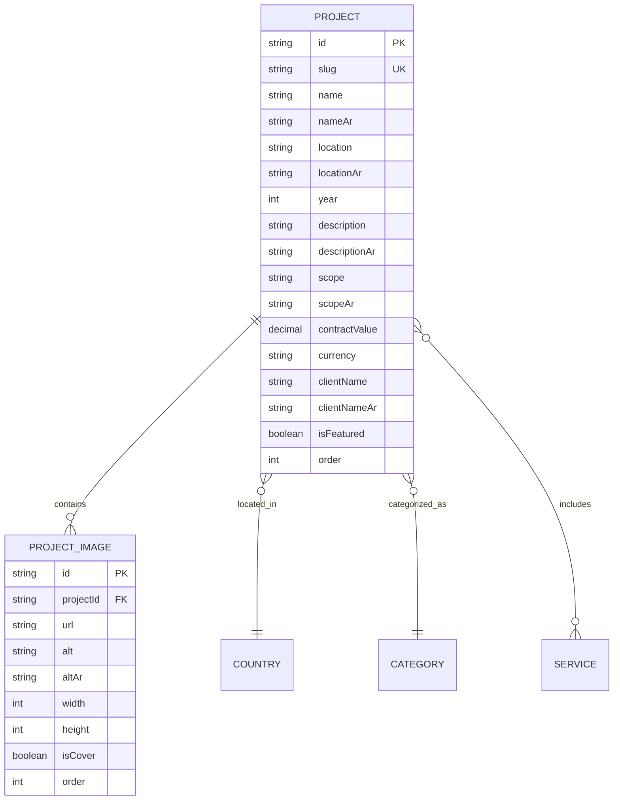

# Future Backend Architecture & Database Strategy

## Overview

The `backend/` directory defines the architectural boundary for the future API and media processing layer.

```text
backend/
└── src/
    ├── modules/
    │   ├── projects/       # Project CRUD, categories, country tags, scope details
    │   ├── services/       # Corporate services management
    │   ├── company/        # Profile info, certifications, stats
    │   ├── media/          # Secure image upload, optimization, CDN distribution
    │   └── auth/           # Admin authentication, JWT handling, role checks
    │
    ├── infrastructure/
    │   ├── database/       # ORM (Prisma / Drizzle) clients and schema definitions
    │   └── storage/        # S3-compatible cloud object storage adapter
    │
    ├── config/             # Backend runtime configuration & env validation
    └── shared/             # Shared filters, guards, and interceptors
```

---

## Database Evaluation & Recommendations

| Database / ORM | Recommendation | Justification |
|---|---|---|
| **PostgreSQL + Prisma** | **Primary Recommendation** | Strongly typed schema matches the corporate domain models (Projects, Images, Categories, Services). Native migrations and seamless integration with TypeScript. |
| **PostgreSQL + Drizzle** | **High Performance Alternative** | Lightweight SQL query builder, serverless friendly. |
| **MongoDB** | **Not Recommended** | Relational integrity (linking projects to services, country tags, and ordering) is better suited to relational SQL. |
| **SQLite** | **Development Only** | Local prototyping only; not suitable for production asset management. |

---

## Data Schema Overview (Future State)


