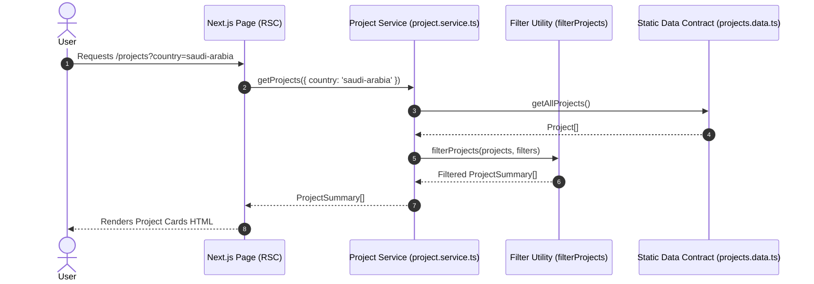
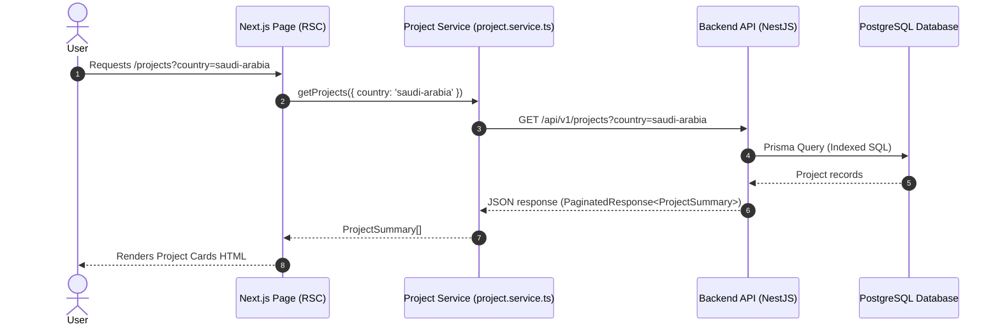

# Data Flow Architecture

## Phase 01 & 02 Flow (Static Mock Data)

---

## Phase 03 Flow (Future Backend & API Integration)

### Key Architectural Benefit
Notice that in both sequence diagrams, **Step 1 and Step 6 are identical**. The UI (`Page` and UI presentation components) does not care whether the data comes from a local static contract or an external NestJS API.
